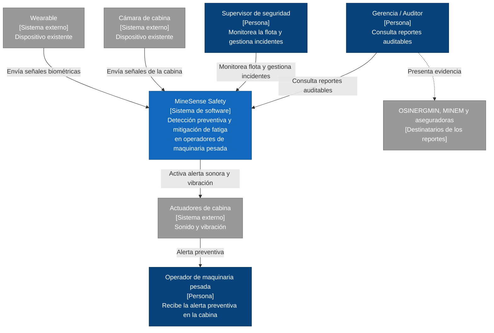

# C1 – Vista de Contexto de MineSense Safety

Fuente: informe del equipo, sección 2.1.4.1 *Vista de Contexto (C4 – Nivel 1)*.

> El informe documenta las vistas C4 como código en Structurizr DSL (`workspace.dsl`), pero ese archivo no forma parte del repositorio aún y los diagramas del informe son imágenes. Este diagrama se reconstruyó **solo a partir de la descripción textual** de la sección 2.1.4.1.

## Elementos

| Elemento | Tipo | Descripción según el informe |
|----------|------|------------------------------|
| Operador | Persona | Recibe la alerta preventiva en la cabina. |
| Supervisor de seguridad | Persona | Monitorea la flota y gestiona incidentes. |
| Gerencia / Auditor | Persona | Consulta reportes auditables para OSINERGMIN, MINEM y aseguradoras. |
| MineSense Safety | Sistema | Sistema integrado de microservicios e IoT para la detección preventiva y mitigación de la fatiga. |
| Wearable, cámara de cabina, actuadores | Sistemas externos | Dispositivos existentes; se modelan como externos en coherencia con CT03 y CT04 (no se fabrica hardware propio y la solución es *hardware-agnostic*). |
| OSINERGMIN, MINEM, aseguradoras | Destinatarios externos | Destinatarios de los reportes auditables. |

## Ambigüedades

- El informe no indica si OSINERGMIN, MINEM y las aseguradoras interactúan directamente con el sistema o solo reciben los reportes a través de la gerencia/auditor; aquí se representan como destinatarios indirectos (línea punteada).
- El tipo exacto de señal que aporta cada dispositivo no se detalla: para el wearable se usa "señales biométricas" por la sección 2.1.5; para la cámara el informe no especifica el formato. La sección 2.1.4.1 no etiqueta las relaciones.
- La alerta en cabina se modela pasando por los actuadores (sonido y vibración, sección 2.1.3 – Alert Service); el diagrama original podría mostrar una relación directa sistema → operador.
