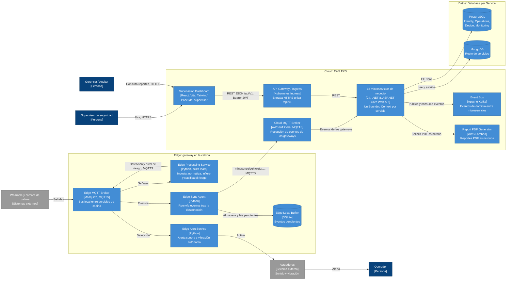

# C2 – Vista de Contenedores de MineSense Safety

Fuente: informe del equipo, sección 2.1.4.2 *Vista de Contenedores (C4 – Nivel 2)*, complementada con 2.1.3 (descomposición), 2.1.5 (tech stack) y 2.1.6 (arquitectura de datos y comunicación).

> El diagrama original del informe es una imagen. Este diagrama se reconstruyó a partir de la tabla de contenedores y de las descripciones textuales. Las relaciones marcadas como *inferidas* en la sección de ambigüedades no aparecen de forma explícita en el texto.

El diagrama agrupa los contenedores **Edge** (gateway en la cabina) y **Cloud** (AWS EKS), e incluye una base de datos por servicio (PostgreSQL y MongoDB), el broker MQTTS, Kafka y la función Lambda.

## Contenedores (tabla del informe)

| Zona | Contenedor | Tecnología | Responsabilidad |
|------|------------|------------|-----------------|
| Edge | Edge Processing Service | Python, scikit-learn | Ingesta, normaliza, infiere y clasifica el riesgo (QAS 02) |
| Edge | Edge Alert Service | Python | Alerta sonora y vibración autónoma en cabina (QAS 01, 05) |
| Edge | Edge Sync Agent + Edge Local Buffer | Python, SQLite | Conserva y reenvía eventos tras la desconexión (QAS 03) |
| Edge | Edge MQTT Broker | Mosquitto (MQTTS) | Bus local entre servicios de cabina |
| Cloud | Cloud MQTT Broker | AWS IoT Core (MQTTS) | Recepción de eventos de los gateways |
| Cloud | Event Bus | Apache Kafka | Eventos de dominio entre microservicios |
| Cloud | 13 microservicios de negocio | C#, .NET 8 | Un Bounded Context por servicio (sección 2.1.3) |
| Cloud | Supervision Dashboard | React, Vite, Tailwind | Panel del supervisor (QAS 06) |
| Cloud | API Gateway / Ingress | Kubernetes Ingress | Entrada HTTPS única `/api/v1` |
| Cloud | Report PDF Generator | AWS Lambda | Reportes PDF asíncronos |
| Datos | 13 bases de datos | PostgreSQL / MongoDB | Database per service |

## Microservicios de negocio y persistencia (sección 2.1.6)

| Microservicio | Epic | Persistencia |
|---------------|------|--------------|
| Identity & Access Service | EP08 | PostgreSQL |
| Operations Service | EP08 | PostgreSQL |
| Device Management Service | EP07 | PostgreSQL |
| Monitoring Service | EP01 | PostgreSQL |
| Fatigue Detection Service | EP02 | MongoDB |
| Alert Service | EP03 | MongoDB |
| Fleet Monitoring Service | EP04 | MongoDB |
| Incident Management Service | EP05 | MongoDB |
| Edge Synchronization Service | EP06 | MongoDB + almacenamiento temporal Edge |
| Privacy & Audit Service | EP09 | MongoDB |
| Reporting Service | EP10 | MongoDB / vistas de lectura |
| Analytics Service | EP11 | MongoDB / modelo analítico |
| Feedback & Reliability Service | EP12 | MongoDB |

Comunicación (sección 2.1.6): REST/HTTPS síncrono (dashboard → backend), MQTTS asíncrono Edge-to-Cloud y Apache Kafka asíncrono Cloud-to-Cloud. Ver [ADR-004](../adr/ADR-004-mqtts-edge-to-cloud-kafka-cloud-to-cloud.md), [ADR-005](../adr/ADR-005-database-per-service-persistencia-poliglota.md) y [ADR-008](../adr/ADR-008-despliegue-eks-lambda-reportes.md).

## Ambigüedades

- **13 vs 12 microservicios.** La sección 2.1.3 describe 12 servicios (EP01–EP12) y asigna EP08 a "Identity & Access Service / Operations"; la tabla de persistencia de 2.1.6 lista un **Operations Service** separado. Se asume que los 13 microservicios son los 12 de 2.1.3 más Operations Service.
- **Consumidor de AWS IoT Core.** El informe no indica qué microservicio recibe los eventos del Cloud MQTT Broker. Por su responsabilidad (EP06) probablemente sea el Edge Synchronization Service, pero el diagrama solo muestra la relación genérica hacia los microservicios.
- **Flujo interno del Edge.** Que los servicios de cabina se comuniquen a través del broker local está explícito en ADR-003; el orden concreto de los mensajes (dispositivos → broker → procesamiento → broker → alerta/sync) es una inferencia.
- **Ubicación del dashboard.** La tabla lo ubica en la zona Cloud; no se especifica si se sirve desde el clúster EKS o desde otro servicio de hosting.
- **Lambda.** Según 2.1.5 y ADR-008, la Lambda genera PDFs para el Reporting Service; el mecanismo de invocación (directo o por evento) no está definido.
- El Structurizr DSL (`workspace.dsl`) mencionado en 2.1.4 no está en el repositorio.
