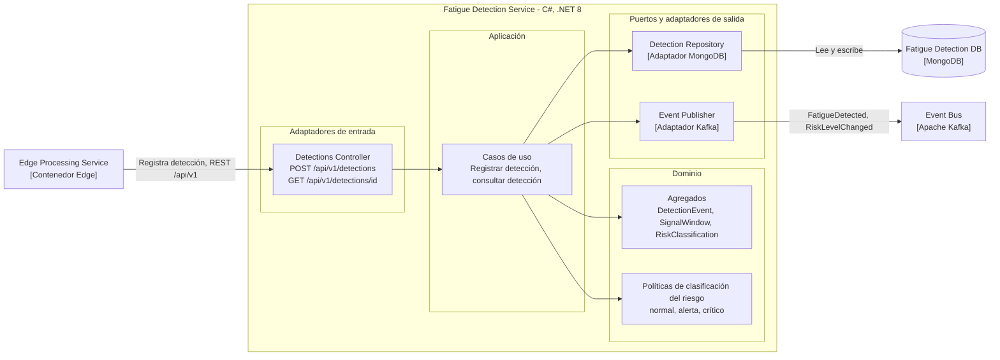
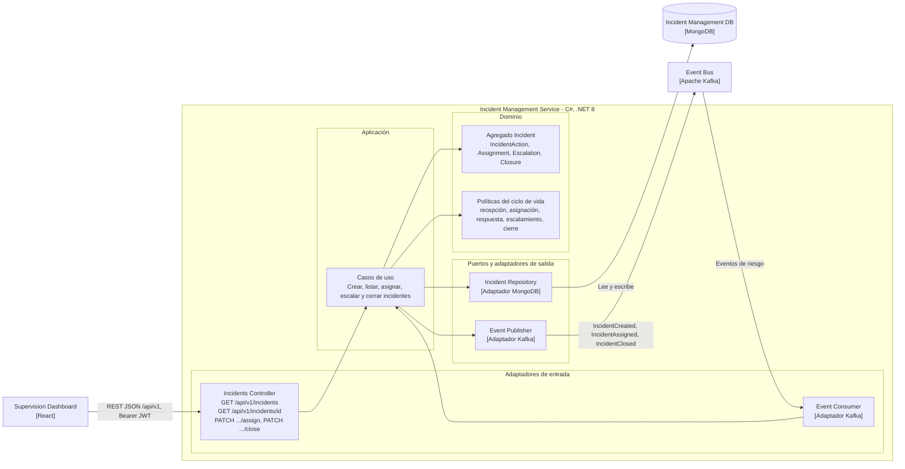
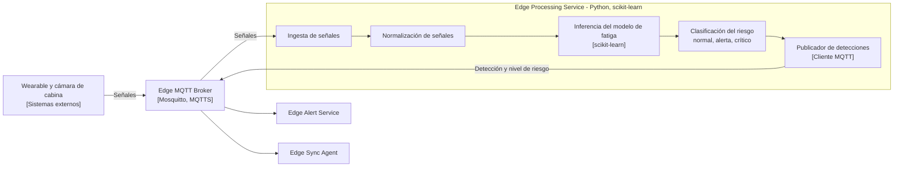

# C3 – Vista de Componentes de MineSense Safety

Fuente: informe del equipo, sección 2.1.4.3 *Vista de Componentes (C4 – Nivel 3)*, complementada con 2.1.4.2 (contenedores) y 2.1.6 (modelo de datos, eventos y endpoints).

Se detallan tres contenedores: dos microservicios cloud (**Fatigue Detection** e **Incident Management**) y el **Edge Processing Service**, por ser el elemento crítico de los QAS 01 y 02.

Los microservicios .NET siguen una **estructura hexagonal**:

| Capa | Rol |
|------|-----|
| Adaptadores de entrada | Controladores y consumidores |
| Aplicación | Casos de uso |
| Dominio | Agregados y políticas |
| Salida | Puertos con adaptadores de salida |

> **Importante.** En el informe, los tres diagramas de componentes son imágenes y la sección 2.1.4.3 no incluye texto sobre los componentes individuales. Los diagramas de abajo aplican la estructura hexagonal descrita a las entidades, eventos y endpoints que el informe asigna a cada servicio en 2.1.6. **Los nombres de los componentes son descriptivos y no provienen del informe**; deben contrastarse con las imágenes originales o con `workspace.dsl` cuando esté disponible.

## Fatigue Detection Service

| Componente | Capa | Respaldo en el informe |
|------------|------|------------------------|
| Detections Controller | Entrada | Endpoints `POST /api/v1/detections` ("Registra una detección generada por el procesamiento Edge") y `GET /api/v1/detections/{id}` (2.1.6). |
| Casos de uso | Aplicación | Derivados de los endpoints anteriores. |
| Agregados `DetectionEvent`, `SignalWindow`, `RiskClassification` | Dominio | Entidades principales del servicio (2.1.6). |
| Políticas de clasificación | Dominio | Clasificación en normal, alerta o crítico (2.1.3). |
| Repositorio MongoDB | Salida | Persistencia MongoDB (2.1.6, ADR-005). |
| Publicador Kafka | Salida | Eventos `FatigueDetected` y `RiskLevelChanged` (2.1.6, ADR-004). |

## Incident Management Service

| Componente | Capa | Respaldo en el informe |
|------------|------|------------------------|
| Incidents Controller | Entrada | Endpoints `GET /api/v1/incidents`, `GET /api/v1/incidents/{id}`, `PATCH /api/v1/incidents/{id}/assign`, `PATCH /api/v1/incidents/{id}/close` (2.1.6). |
| Event Consumer | Entrada | "Controladores y consumidores" como adaptadores de entrada (2.1.4.3). |
| Casos de uso | Aplicación | Ciclo de vida del incidente (2.1.3, EP05). |
| Agregado `Incident` | Dominio | Entidades `Incident`, `IncidentAction`, `Assignment`, `Escalation`, `Closure` (2.1.6). |
| Políticas del ciclo de vida | Dominio | Recepción, asignación, respuesta, escalamiento y cierre (2.1.3). |
| Repositorio MongoDB | Salida | Persistencia MongoDB (2.1.6). |
| Publicador Kafka | Salida | Eventos `IncidentCreated`, `IncidentAssigned`, `IncidentClosed` (2.1.6). |

## Edge Processing Service

| Componente | Respaldo en el informe |
|------------|------------------------|
| Ingesta, normalización, inferencia y clasificación | Responsabilidad del contenedor: "Ingesta, normaliza, infiere y clasifica el riesgo" (2.1.4.2, QAS 02); scikit-learn y pytest (2.1.5, ADR-006). |
| Publicador MQTT | Los contenedores del gateway se comunican por el broker local (ADR-003). |
| Niveles de riesgo | Normal, alerta o crítico (2.1.3). |

## Ambigüedades

- Los nombres y la granularidad de los componentes son una reconstrucción (ver nota inicial).
- El informe no indica qué eventos consume el Incident Management Service para crear un incidente (podrían ser `FatigueDetected`, `RiskLevelChanged` o `AlertGenerated`); por eso el diagrama usa la etiqueta genérica "Eventos de riesgo".
- No se especifica si el Fatigue Detection Service consume eventos de Kafka además de recibir detecciones por REST; tampoco si recibe detecciones vía AWS IoT Core. Solo el endpoint `POST /api/v1/detections` está documentado.
- No se especifica si el Edge Processing Service recibe las señales de los dispositivos a través del broker local o directamente.
- La validación del JWT (ADR-007) se haría en los adaptadores de entrada de cada servicio, pero el informe no la muestra como componente.
