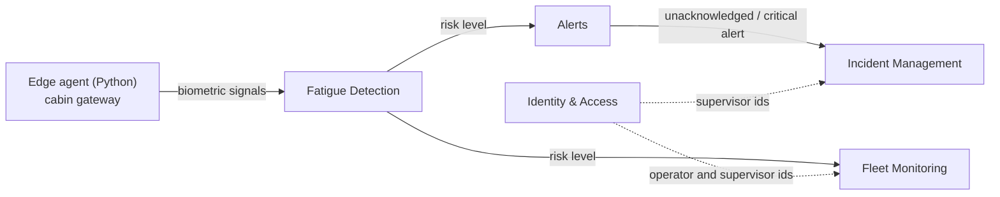

# MineSense Safety — Context Map (DDD)

This document is the entry point to the domain model of the backend. Each microservice in
`src/backend` is one **bounded context** and owns its data, its ubiquitous language and its
API. Contexts never share database tables or domain classes; they integrate through REST
contracts today and through events (Kafka / MQTT) as the platform evolves.

## Bounded contexts implemented in the monorepo

| Bounded context | Service | Epic | Aggregate root | Responsibility |
|---|---|---|---|---|
| Identity & Access | `IdentityAccessService` | EP08 | `User` | Sign-up, sign-in, roles and account deactivation. |
| Fatigue Detection | `FatigueDetectionService` | EP02 | `FatigueAssessment` | Turns biometric signals into a risk level (Normal, Warning, Critical). |
| Alerts | `AlertService` | EP03 | `Alert` | Issues the in-cabin warning, records the operator acknowledgement or escalates it. |
| Fleet Monitoring | `FleetMonitoringService` | EP04 | `MonitoredOperator` | Control-center view of operators, vehicles, shifts and current risk with combined filters. |
| Incident Management | `IncidentManagementService` | EP05 | `Incident` | Incident lifecycle: pending, assigned, actions, escalation and closure. |

Contexts described in the report (section 2.1.3) but not yet scaffolded: Monitoring (EP01),
Edge Synchronization (EP06, lives in `src/edge`), Device Management (EP07), Privacy & Audit
(EP09), Reporting (EP10), Analytics (EP11) and Feedback & Reliability (EP12). New contexts
must follow the same layer layout described below.

## Relationships



- **Fatigue Detection → Alerts / Fleet Monitoring**: customer–supplier. Fatigue Detection
  publishes the assessment; downstream contexts translate it into their own `RiskLevel` or
  `AlertSeverity` (each context keeps its own enum on purpose).
- **Alerts → Incident Management**: customer–supplier. An escalated alert opens an incident
  that references the `AlertId` only.
- **Identity & Access → everyone**: other contexts store user ids, never user data
  (conformist on identifiers, protects personal data per EP09 and Ley N.° 29733).

## Layer layout inside every service

```
<Service>/
├── Domain/                      ← pure business model, no framework code
│   ├── Model/
│   │   ├── Aggregates/          ← aggregate roots that enforce the invariants
│   │   ├── ValueObjects/        ← immutable concepts and enums of the language
│   │   ├── Commands/            ← intentions that change state
│   │   └── Queries/             ← intentions that read state
│   ├── Repositories/            ← persistence ports (interfaces)
│   └── Services/                ← command / query service contracts, domain policies
├── Application/
│   └── Internal/
│       ├── CommandServices/     ← use cases that change state
│       ├── QueryServices/       ← use cases that read state
│       └── OutboundServices/    ← ports to external capabilities (e.g. hashing)
├── Infrastructure/              ← adapters: persistence, hashing, messaging
│   └── Persistence/InMemory/    ← temporary adapter until PostgreSQL / MongoDB
├── Interfaces/
│   └── REST/                    ← controllers
│       ├── Resources/           ← request / response DTOs
│       └── Transform/           ← assemblers resource ↔ command / entity
└── Program.cs                   ← composition root (dependency injection)
```

Dependencies only point inwards: `Interfaces → Application → Domain` and
`Infrastructure → Domain`. The **shared kernel** (`src/backend/Shared`) contains only the
technical base types every context agrees on: `AggregateRoot`, `DomainException`,
`IBaseRepository<T>`, the in-memory repository and the common Web API setup (kebab-case
routes, Swagger, `DomainException` → HTTP 422).

## Ubiquitous language (excerpt)

| Term | Context | Meaning |
|---|---|---|
| Fatigue assessment | Fatigue Detection | One evaluation of an operator's signals that yields a risk level. |
| PERCLOS | Fatigue Detection | Percentage of time the eyes are closed in a window; main fatigue indicator. |
| Risk level | Fatigue Detection, Fleet Monitoring | Normal, Warning or Critical. |
| Alert | Alerts | Preventive in-cabin warning (sound / vibration) linked to an assessment. |
| Acknowledgement | Alerts | Operator confirms they perceived the alert. |
| Escalation | Alerts, Incident Management | Hand-off to the supervisor when there is no acknowledgement or the risk persists. |
| Incident | Incident Management | Formal follow-up of a risk event until it is closed with a resolution. |
| Incident action | Incident Management | Step taken by the assigned supervisor, with its outcome. |
| Monitored operator | Fleet Monitoring | Operator as seen by the control center: vehicle, fleet, shift, location, risk. |
